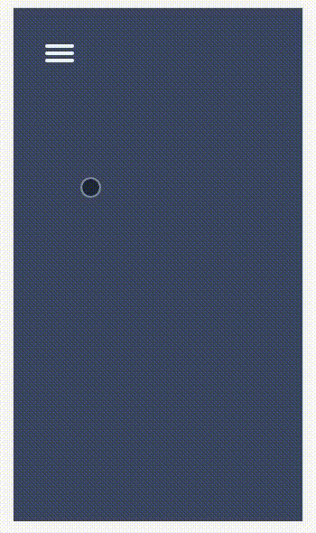
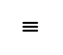

In this article you will learn how to make an animated hamburger menu using the CSS tranform and transition properties and some vanilla Javascript. We will be building this:



## The Setup

I've created a [github repo](https://github.com/nelsongv/Menu-Button-BoilerPlate) where you can find the starter files, which is just a basic HTML structure with the CSS and JS files

### The MarkUp

The HTML for this one is very simple, consisting of one div which will be the hamburger menu button and a nav tag which will contain our navigation bar.

```html
<body>
  <div class="menu-button">
    <div class="menu-button-item"></div>
    <div class="menu-button-item"></div>
    <div class="menu-button-item"></div>
  </div>
  <nav class="menu-nav">
    <ul>
      <li class="menu-nav-item">Item 1</li>
      <li class="menu-nav-item">Item 2</li>
      <li class="menu-nav-item">Item 3</li>
    </ul>
  </nav>
  <script src="main.js"></script>
</body>
```

### Finally some CSS

We will start by creating the hamburger menu. Each div with the class of `menu-button-item` will be what makes up our hamburger menu button. In order to create it, we will give it the following styles:

```css
.menu-button {
  top: 35px;
  left: 35px;
  width: 32px;
  height: 32px;
  cursor: pointer;
  position: fixed;
}

.menu-button-item {
  width: 100%;
  height: 4px;
  margin: 0 0 4px 0;
  background-color: black;
  border-radius: 2px;
}

.menu-button-item:nth-child(1) {
  margin-top: 5px;
}
nav.menu-nav {
  display: none;
}
```

The `menu-button` div has basic styling regarding its size. It is important to set the `cursor: pointer` property to make it clickable and its position fixed, so it will remain on the screen at all times. The `menu-button-item` divs have a height of 4px and width of 100%, and by giving them a background color, we create each line of the menu. We have also set the nav to `display:none` so it will not appear when the page is rendered.

At this point, we have the hamburger menu at the top left corner of the screen which looks like this:



### Adding the JS

Before working on the CSS transitions, we will add some Javascript that will enable us to add and remove a class to our menu, which will be what triggers the animation. We will use querySelector to select the elements, and add an event listener that will add the class `show` to the menu-button div and the nav block. Also, we will create a stateClose vaiable that will handle our state to let us know if the button is open or closed. With this logic, every time we click the button the class `show` will be toggled on these two elements.

```js
const menuButton = document.querySelector('.menu-button')
const nav = document.querySelector('nav')

let stateClose = true

menuButton.addEventListener('click', function() {
  if (stateClose) {
    menuButton.classList.add('show')
    nav.classList.add('show')
    stateClose = false
  } else {
    menuButton.classList.remove('show')
    nav.classList.remove('show')
    stateClose = true
  }
})
```

### CSS Transform Property

Add this point, we are ready to start animating the button. We will do this by adding the transform property to the elements with the `show` class. Whenever the button is clicked, the `show` class will be added to the `menu-button` div and hence, it will create some movement on the element. We will also add a transition property which will animate the changes specified in the transform property. We will apply the following styles:

```css
.menu-button {
  top: 35px;
  left: 35px;
  width: 32px;
  height: 32px;
  cursor: pointer;
  transition: all 0.5s ease-out;
  position: fixed;
}

.menu-button.show {
  transform: rotate(180deg);
}

.menu-button.show .menu-button-item:nth-child(1) {
  transform: rotate(45deg) translate(5px, 6px);
}

.menu-button.show .menu-button-item:nth-child(2) {
  transform: rotate(-45deg) translate(0px, 0);
}

.menu-button.show .menu-button-item:nth-child(3) {
  opacity: 0;
}
```

Transitions in CSS enable us to define the transitions between two states of an element. In this case, we have specified that in all properties, we will have a 0.5s duration on the transition, with an ease-out effect. On each `menu-button-item`, we have rotated two of the divs to create the X and have hidden the third div using the `opacity` porperty and setting it to 0.

### Navbar

Having the menu button ready, we will add some styling to the nav. Like the menu-button, we will add styles to the nav on its default state and when it has the `show` class applied.

```css
nav.menu-nav {
  background-color: black;
  width: 65%;
  height: 100vh;
  right: 0px;
  position: fixed;
  z-index: 3;
  display: none;
}

nav.menu-nav.show {
  display: block;
  display: flex;
  flex-direction: column;
  justify-content: center;
  align-items: center;
}
```

We have given the nav a position fixed value and a height of 100vh so it can take all the screen's space, but a width of only 65% coming from the right side. On the nav with `show` class, we have added display block to make it appear and some flexbox, which will be talking about in a liitle bit.

### Final details on the Nav

For the finishing touches, we will style the `li` elements and the `ul` like this:

```css
/*From previous part*/
nav.menu-nav.show {
  display: block;
  display: flex;
  flex-direction: column;
  justify-content: center;
  align-items: center;
}

/* --- */
nav.menu-nav ul {
  padding: 0;
  list-style: none;
}

nav.menu-nav li {
  width: 100%;
  display: inline-block;
  text-align: center;
  padding: 1rem 0;
  color: white;
  text-transform: uppercase;
  font-weight: 700;
  font-size: 1.75rem;
  letter-spacing: 1.5px;
}
```

The flexbox styling we gave it is a great way to center the `li` elements. By adding a flex-direction, justify-content and align items, we can center the elements horizontally and vertically. We have also removed the bullet points and added 0 padding on the `ul`.

CONGRATS! You have built the animated menu from scratch!

As a final touch, I have changed some of the colors of the body, menu button and nav, using CSS variables.

You can find the finished files on this [github repo](https://github.com/nelsongv/Menu-Button-BoilerPlate).

The final CSS looks like this:

```css
/* CSS Variables*/
:root {
  --main-bg-color: #3a4660;
  --primary-color: #edf2f4;
  --secondary-color: #ff8c00;
}

* {
  box-sizing: border-box;
}

body {
  margin: 0;
  padding: 0;
  background-color: var(--main-bg-color);
}

nav.menu-nav {
  background-color: var(--primary-color);
  width: 65%;
  height: 100vh;
  right: 0px;
  position: fixed;
  z-index: 3;
  display: none;
}

nav.menu-nav.show {
  display: block;
  display: flex;
  flex-direction: column;
  justify-content: center;
  align-items: center;
}

nav.menu-nav ul {
  padding: 0;
  list-style: none;
}

nav.menu-nav li {
  width: 100%;
  display: inline-block;
  text-align: center;
  padding: 1rem 0;
  color: var(--main-bg-color);
  text-transform: uppercase;
  font-weight: 700;
  font-size: 1.75rem;
  letter-spacing: 1.5px;
}

nav.menu-nav li:hover {
  color: var(--secondary-color);
}

.menu-button {
  top: 35px;
  left: 35px;
  width: 32px;
  height: 32px;
  cursor: pointer;
  transition: all 0.5s ease-out;
  position: fixed;
}

.menu-button-item {
  width: 100%;
  height: 4px;
  margin: 0 0 4px 0;
  background-color: var(--primary-color);
  border-radius: 2px;
}

.menu-button-item:nth-child(1) {
  margin-top: 5px;
}

.menu-button.show {
  transform: rotate(180deg);
}

.menu-button.show .menu-button-item:nth-child(1) {
  transform: rotate(45deg) translate(5px, 6px);
}

.menu-button.show .menu-button-item:nth-child(2) {
  transform: rotate(-45deg) translate(0px, 0);
}

.menu-button.show .menu-button-item:nth-child(3) {
  opacity: 0;
}
```

Hope you find this one useful!
