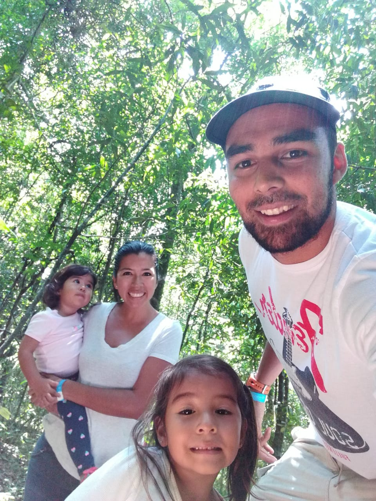

Hi! Thanks for stopping by my blog. My name is Nelson Gutiérrez. I am a self-taught front end developer based in Costa Rica. In my journey, I have learned tons reading coding blogs (and continue to do so), which is why I decided to start this blog. 

*This is a picture with my beautiful family hiking in the Costa Rican mountains.*

I create cool websites and web applications. I'm currently working as a Front End Developer at GFT Costa Rica with an awesome team and a very challenging yet amazing project.

You can contact me at : nelson.gutierrez.vega@gmail.com.

Thanks for stopping by!
